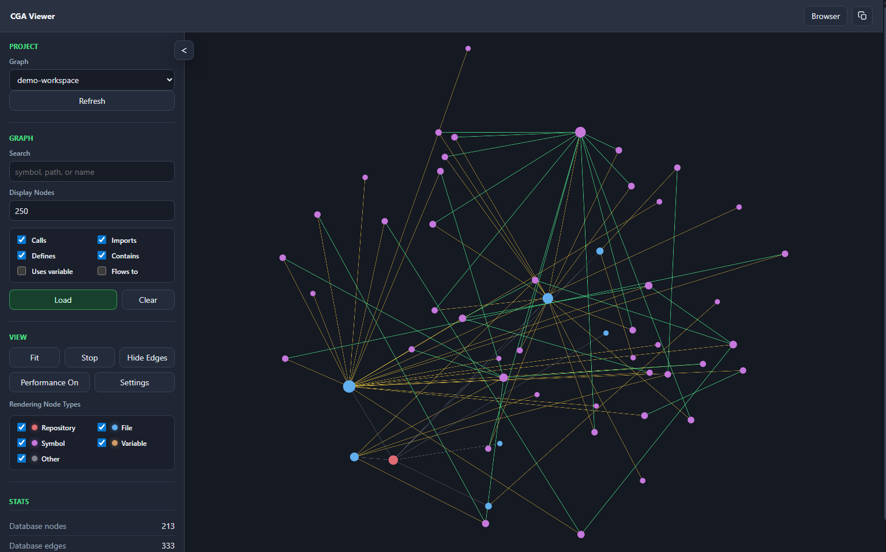
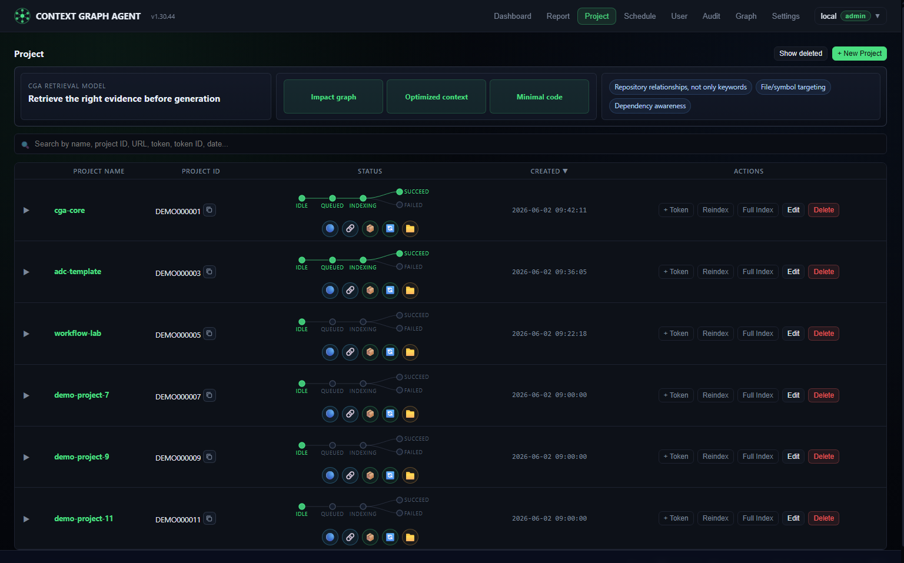
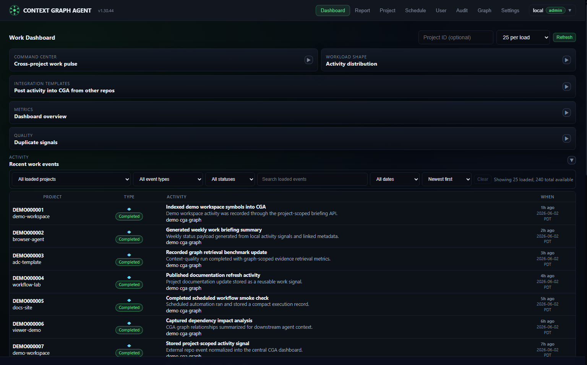
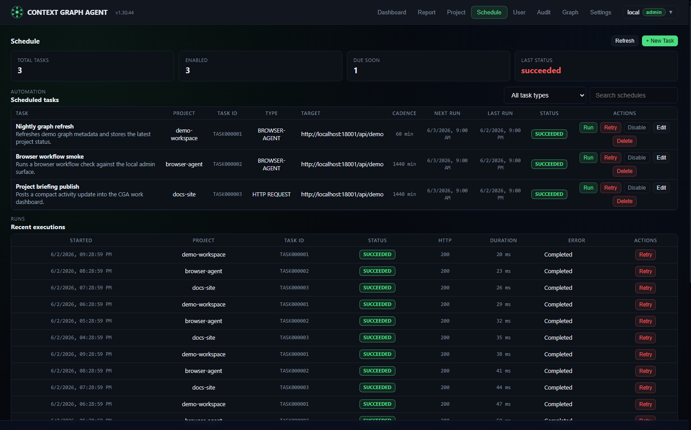
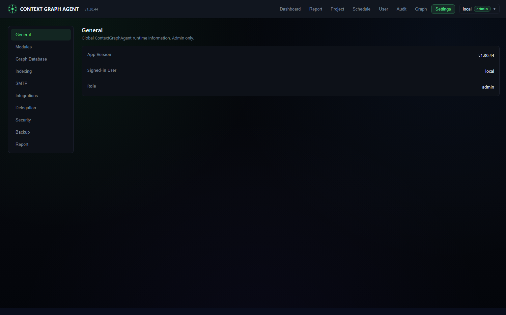
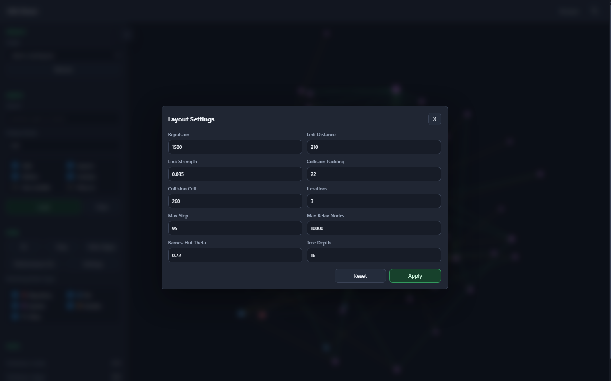
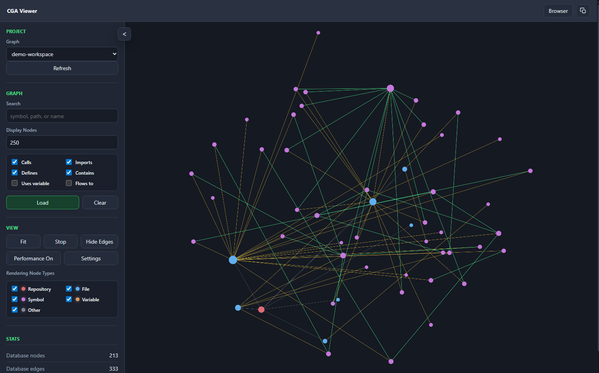

# CGA (Context Graph Agent)

- **Version:** 1.30.99
- **Status:** Published
- **Author:** Nate Scott
- **Date:** 2026-06-19 (release docs aligned and relay local notes excluded)

CGA, aka Context Graph Agent, is a local-first graph context service that gives AI coding agents focused code evidence instead of dumping whole files or broad search results into prompts.

CGA is dedicated to AI-FIRST engineering teams that want local, evidence-backed context for agentic development workflows.

In the current live multi-project benchmark, CGA reduced prompt tokens by **90.44%** on average while lowering Hallucination Pressure Score by **13.34%** across **102 real-code cases**.



## Why CGA

- Retrieves target symbol excerpts, nearby relationship context, dependency paths, and recent project facts.
- Indexes repository files, symbols, calls, imports, and lightweight data flow into FalkorDB.
- Exposes MCP-compatible tools so AI coding agents can query repository relationships before generation.
- Keeps project context local-first while still offering an Admin Dashboard for indexing, settings, schedules, and work activity.
- Helps agents answer, edit, and search through repositories with less prompt waste and lower evidence ambiguity.

## Quick Start

### Option A: Docker Desktop Release

Use this path for the easiest local Windows launch.

1. Install Docker Desktop.
2. Download `CGA-Docker-Desktop-<version>.zip` from the release artifacts.
3. Unzip it and double-click `start-cga-desktop.cmd`.

Open `http://localhost:18001/admin`.

### Option B: Run From Source

Use this path for development from a fresh clone.

```bash
git clone https://github.com/nascousa/cga.git
cd cga
cp .env.example .env
docker compose --profile dev up --build
```

Windows PowerShell equivalent:

```powershell
Copy-Item .env.example .env
docker compose --profile dev up --build
```

Open:

- Admin UI: `http://localhost:8001/admin`
- MCP discovery: `http://localhost:8001/mcp`
- FalkorDB Browser: `http://localhost:13000`

For the repository-root desktop stack, use:

```powershell
Copy-Item .env.example .env
./src/scripts/start-desktop.ps1 start
```

That stack opens the Admin UI at `http://localhost:18001/admin`.

## What You Get

- **Admin Dashboard:** project registration, user access groups, indexing status, settings, schedules, and operational views.
- **3D Graph Viewer:** visual exploration of repository relationships and graph layout controls.
- **MCP-compatible API:** agent-facing retrieval tools for symbols, files, dependencies, imports, variable flow, and architecture queries.
- **CGA-Relay:** one developer-machine `cga-relay` with stdio MCP gateway, local scan/sync, and safe config examples. See [docs/cga-relay.md](docs/cga-relay.md).
- **Work Briefing Aggregation:** WA-compatible activity capture and briefing summaries inside CGA.
- **AI-First Readiness And Evidence:** Admin APIs for readiness snapshots, GitHub/Azure DevOps/verification signals, evidence packs, PR evidence links, and policy-derived gates that combine graph, indexing, ADC, governance, and work activity signals.
- **Schedule Automation:** admin-defined recurring jobs for BrowserAgent page tests, agent activation calls, and generic HTTP tasks.
- **Runtime Backup:** PostgreSQL and FalkorDB snapshots for local-first persistence and recovery.
- **Upgrade Center:** admin-visible upgrade readiness, backup status, schema compatibility, relay guidance, and copyable upgrade commands.

## Screenshots

| Project Console | Work Dashboard |
|---|---|
|  |  |

| Schedule Automation | Runtime Settings |
|---|---|
|  |  |

| Graph Layout Controls | Graph Canvas Focus |
|---|---|
|  |  |

## Benchmark Snapshot

The latest live database-backed run selected three active projects from CGA, generated 34 deterministic symbol-level cases per project, and compared broad source context against graph-scoped CG context.

| Metric | Result |
|---|---:|
| Projects | 3 |
| Cases per project | 34 |
| Total real-code cases | 102 |
| Average baseline HPS | 17.66 |
| Average CG HPS | 13.94 |
| Average HPS reduction | 13.34% |
| Average baseline tokens | 5,474.95 |
| Average CG tokens | 483.29 |
| Average token reduction | 90.44% |

The run is intentionally reported with nuance: one project's HPS increased under the conservative neighboring-context setup, while the cross-project average improved. See [docs/benchmarks/live-context-quality.md](docs/benchmarks/live-context-quality.md) for the full table, methodology, and reproduction command.

## Documentation

- [Docker Desktop bundle](deploy/docker-desktop/README.md) - one-click local distribution and release zip behavior.
- [Runtime operations](docs/runtime-operations.md) - work briefing, schedules, persistence, backup, and default local runtimes.
- [AI-first readiness](docs/ai-first-readiness.md) - readiness snapshots and observe-only evidence packs for AI-first team planning.
- [AI-first correlation contract](docs/ai-first-correlation-contract.md) - standard task, issue, PR, and activity ids for evidence packs and traces.
- [MCP query quickstart](docs/mcp-agent-query-quickstart.md) - endpoint discovery, query clients, batch mode, and CG-first strategy.
- [Benchmark guide](docs/benchmarks/README.md) - deterministic context-quality benchmark model and commands.
- [Live benchmark report](docs/benchmarks/live-context-quality.md) - current live multi-project benchmark summary.
- [ADC framework notes](docs/adc-framework.md) - project context governance and AI-agent operating model.
- [Publishing guide](docs/PUBLISHING.md) - release channels, maintainer preflight, tags, and public launch settings.
- [Security policy](SECURITY.md) - vulnerability reporting and security baselines.

## Community

- [Contributing](CONTRIBUTING.md)
- [Code of Conduct](CODE_OF_CONDUCT.md)
- [Security reporting](SECURITY.md)
- [Bug report template](.github/ISSUE_TEMPLATE/bug_report.yml)
- [Feature request template](.github/ISSUE_TEMPLATE/feature_request.yml)
- [Pull request template](.github/pull_request_template.md)

## Author And Attribution

CGA (Context Graph Agent) was created and authored by Nate Scott. Public documentation, release notes, desktop bundle documentation, redistributions, and project notices should preserve that attribution while keeping promotional surfaces focused on the product experience.

## License And Notices

CGA is released under the Apache License, Version 2.0. See [LICENSE](LICENSE).

- [OPEN_SOURCE.md](OPEN_SOURCE.md)
- [DISCLAIMER.md](DISCLAIMER.md)
- [NOTICE.md](NOTICE.md)
- [THIRD_PARTY_NOTICES.md](THIRD_PARTY_NOTICES.md)
- [CONTRIBUTING.md](CONTRIBUTING.md)
- [SECURITY.md](SECURITY.md)

## Star History

<a href="https://www.star-history.com/?repos=nascousa%2Fcga&type=date&legend=top-left">
 <picture>
   <source media="(prefers-color-scheme: dark)" srcset="https://api.star-history.com/chart?repos=nascousa/cga&type=date&theme=dark&legend=top-left" />
   <source media="(prefers-color-scheme: light)" srcset="https://api.star-history.com/chart?repos=nascousa/cga&type=date&legend=top-left" />
   
 </picture>
</a>