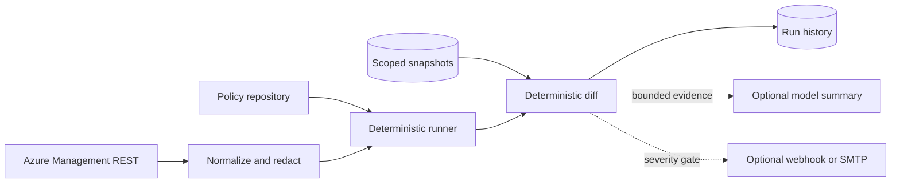

# Azure Policy Change Monitor

The Azure Policy Change Monitor is a read-only CGA extension for repository policy checks and deployed Azure Policy drift. It collects policy definitions, initiatives, assignments, compliance state, and related control-plane activity; normalizes that evidence; compares it with the previous snapshot for the same Azure scope; and emits deterministic findings.

Model summaries and notifications are optional output adapters. They never decide whether drift occurred and their failure never changes a successful monitor run into a failed one.

## Capabilities

- Compare policy files across cloud folders and detect GUID, version, parity, and risky-effect issues.
- Inventory deployed definitions, initiatives, and assignments at subscription or management-group scope.
- Detect additions, deletions, content changes, scope expansion, enforcement-mode changes, parameter changes, and identity changes.
- Track compliance-count changes and deduplicate overlapping Activity Log evidence.
- Store scope-isolated snapshots and bounded history in the CGA database.
- Generate an optional evidence-grounded summary through Azure OpenAI or an OpenAI-compatible chat-completions endpoint.
- Send severity-gated Adaptive Card webhooks and SMTP email.
- Run interactively from the Extensions page or as an internal CGA scheduled task.

## Architecture



CGA owns extension configuration, project scope, scheduling, run history, snapshot persistence, retention, and the admin UI. The extension owns collection, normalization, drift rules, summary grounding, and notification payloads.

## Quick Start

1. Start CGA with its database and `schedule_worker` runtime module enabled.
2. Open **Extensions**, select **Azure Policy Change Monitor**, and choose repository, Azure, or both sources.
3. For Azure collection, set exactly one effective scope with `subscription_id`, `management_group_id`, or `azure_scope`.
4. Select an authentication mode. Managed identity is recommended for Azure-hosted CGA; Azure CLI is intended for local development.
5. Save and choose **Run now**. The first successful Azure run creates a baseline and intentionally reports no deployed-state drift.
6. Review the second run, then create a schedule. Keep the Activity Log lookback at least as long as the schedule cadence.

For production rollout, RBAC, cloud endpoints, and failure procedures, see [Operations](docs/OPERATIONS.md).

## Configuration

All fields are available in the Extensions admin page. Values are persisted only after validation.

### Sources and Azure State

| Key | Default | Purpose |
| --- | --- | --- |
| `repo_scan_enabled` | `true` | Enable repository checks. |
| `repo_path` | project repository | Repository root; Windows `D:\Repos\...` paths map to `/repos/...` in CGA containers. |
| `policy_root` | `settings/BuiltInPoliciesV2` | Policy folder relative to the repository. |
| `cloud_folders` | `AllEnvironments, USNat, USSec` | Folders compared by the repository scanner. |
| `baseline_folder` | `AllEnvironments` | Reference folder for parity checks. |
| `azure_monitor_enabled` | `false` | Enable deployed Azure collection and snapshots. |
| `subscription_id` | empty | Subscription scope and default Activity Log subscription. |
| `management_group_id` | empty | Management-group scope shorthand. |
| `azure_scope` | empty | Full subscription or management-group resource ID; takes precedence over the shorthand fields. |
| `activity_subscription_ids` | empty | Subscriptions whose Activity Logs are queried for a management-group monitor. Required when management-group activity is enabled. |
| `include_compliance` | `true` | Query latest Policy Insights state. |
| `include_activity` | `true` | Query `Microsoft.Authorization` Activity Log events. |
| `activity_lookback_minutes` | `1440` | Activity window, from 1 to 43,200 minutes. |
| `snapshot_retention_count` | `90` | Maximum snapshots retained per normalized Azure scope. |
| `max_collection_items` | `50000` | Hard limit per collected Azure result stream. |
| `azure_timeout_seconds` | `30` | Per-request timeout. |
| `azure_max_attempts` | `4` | Bounded retries for transient HTTP status codes. |
| `read_only` | `true` | Mandatory safety boundary; `false` is rejected. |

Snapshots are keyed by extension, project or platform scope, and normalized Azure scope. Changing scope starts an independent baseline rather than comparing unrelated estates.

### Authentication

`auth_mode` accepts:

| Mode | Inputs | Use |
| --- | --- | --- |
| `managed_identity` | Azure host identity; optional `managed_identity_client_id` | Recommended production mode. |
| `workload_identity` | `AZURE_TENANT_ID`, `AZURE_CLIENT_ID`, `AZURE_FEDERATED_TOKEN_FILE` | Federated Kubernetes or CI workload. |
| `environment` | Tenant/client ID plus `AZURE_CLIENT_SECRET` or a federated token file | Headless process; prefer federation over a secret. |
| `azure_cli` | Active `az login` session | Local operator testing only. |
| `auto` | Environment, hosted identity endpoint, Azure CLI, then IMDS | Convenient discovery; use an explicit mode in production. |

Tokens, assertions, client secrets, and identity endpoint headers are read at runtime and are never written to extension configuration or run history.

### Cloud Endpoints

Set all three values together when leaving Azure public cloud.

| Cloud | `management_endpoint` | `authority_host` | `arm_token_scope` |
| --- | --- | --- | --- |
| Public | `https://management.azure.com` | `https://login.microsoftonline.com` | `https://management.azure.com/.default` |
| US Government | `https://management.usgovcloudapi.net` | `https://login.microsoftonline.us` | `https://management.usgovcloudapi.net/.default` |
| China | `https://management.chinacloudapi.cn` | `https://login.chinacloudapi.cn` | `https://management.chinacloudapi.cn/.default` |

Only HTTPS management and authority endpoints are accepted. Pagination links must stay on the configured management origin.

## Optional Summary

Set `model_summary_enabled=true` only when a human-readable evidence summary is useful. Monitoring remains fully functional without a model.

For Azure OpenAI, configure an HTTPS resource endpoint, `model_deployment`, `model_api_version`, and either:

- `model_auth_mode=azure` with `model_token_scope=https://cognitiveservices.azure.com/.default`; or
- `model_auth_mode=api_key`, `model_api_key_header=api-key`, and an environment-variable name in `model_api_key_env`.

For an OpenAI-compatible endpoint, set the endpoint ending in `/v1`, `model_name`, `model_auth_mode=api_key`, and `model_api_key_header=authorization` when the provider expects a Bearer key.

The key itself must exist only in the named environment variable, such as `AZURE_POLICY_MONITOR_MODEL_API_KEY`. Endpoint credentials and secret-bearing query parameters are rejected.

The model receives at most 100 recursively redacted findings. Returned items are accepted only when they cite an evidence ID supplied by the deterministic monitor. Unknown IDs, duplicate IDs, oversized output, and unstructured output are discarded or reported as a non-fatal summary failure.

## Notifications

Set `notifications_enabled=true`, choose `notification_min_severity`, and configure at least one channel:

- Webhook: set `notification_webhook_env` to the name of an environment variable containing an absolute HTTPS webhook URL.
- Email: set `notification_email_recipients` and configure SMTP through CGA runtime settings. Supply the password only through `CGA_SMTP_PASSWORD`; attempts to persist `smtp.password` are rejected.

Notifications run after the monitor result and snapshot are recorded. Delivery status is visible under **Latest delivery**. Failed providers are represented only by failure type so response bodies, URLs, credentials, and exception text do not enter run history.

## Scheduling

CGA schedules the extension through an internal `extension_task` with extension ID `azure_policy_change_monitor`. The scheduler calls the same service path as **Run now**, so project configuration, scope-specific baselines, retention, output behavior, and audit history remain consistent.

Recommended starting cadences:

| Estate | Cadence | Activity lookback |
| --- | --- | --- |
| Development subscription | 30-60 minutes | 120 minutes |
| Production subscription | 15-30 minutes | 60 minutes |
| Management group | 30-60 minutes | 120 minutes |

Use overlap to tolerate delayed events. Stable Activity Log IDs prevent the same event from becoming a new finding on every overlapping run.

## Security Properties

- All Azure Management calls are `GET` or read-only Policy Insights `POST` queries; no mutation method exists.
- Inline access tokens, API keys, passwords, client secrets, assertions, credentials, and webhook URLs are rejected recursively.
- Sensitive policy parameter values are replaced with a redaction marker and stable hash before persistence.
- Model input is bounded and recursively redacted.
- Requests use HTTPS, trusted-origin pagination, bounded timeouts, bounded retries, page limits, and item limits.
- Model and notification failures are non-fatal and never suppress deterministic findings.
- Persisted extension failures contain `error_type`, not arbitrary exception text.

## Validation

From the repository root:

```powershell
.\.venv\Scripts\python.exe -m pytest src\tests\test_azure_policy_monitor_*.py src\tests\test_extensions_service.py src\tests\test_runtime_config.py -q
.\.venv\Scripts\python.exe -m ruff check extensions\azure-policy-monitor\src src\backend\extensions src\backend\runtime_config.py src\tests\test_azure_policy_monitor_*.py src\tests\test_extensions_service.py src\tests\test_runtime_config.py
```
